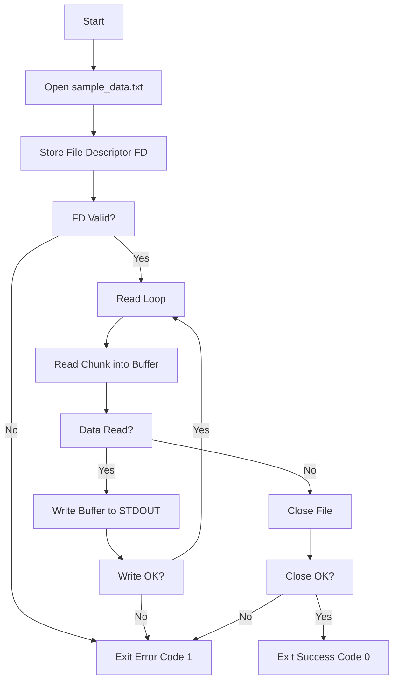

# Day 1: File Reader (NASM 32-bit)

## Description

This program (`day1.asm`) is written in NASM assembly for a 32-bit Linux environment. Its purpose is to open a text file named `sample_data.txt` located in the same directory, read its contents, and print those contents to the standard output (the terminal).

## Assembly Sections

-   **`.data`**: This section holds initialized data, specifically the filename string (`sample_data.txt`) that the program needs to access.
-   **`.bss`**: This section reserves space for uninitialized data. Here, it reserves a buffer (`buffer`) of 1024 bytes, which will be used to temporarily store data read from the file.
-   **`.text`**: This section contains the actual program code (instructions).

## Program Logic

The program executes the following steps:

1.  **Open File**: Uses the `SYS_OPEN` (system call number 5 for 32-bit) to open `sample_data.txt` in read-only mode. The file descriptor returned by the kernel is stored.
2.  **Error Check (Open)**: Checks if the file descriptor is valid (>= 0). If not, it jumps to an error exit routine.
3.  **Read Loop**: Enters a loop to read the file contents.
    *   **Read Chunk**: Uses the `SYS_READ` (system call number 3) to read up to `buffer_size` bytes from the file into the `buffer`.
    *   **Check EOF/Error (Read)**: Checks the return value of `SYS_READ`. If it's 0 or less, it means the end of the file has been reached or an error occurred, so it jumps to the close file routine.
    *   **Write Chunk**: Uses the `SYS_WRITE` (system call number 4) to write the number of bytes actually read from the `buffer` to standard output (file descriptor 1).
    *   **Error Check (Write)**: Checks if the write operation was successful. If not (return value < 0), it jumps to the error exit routine.
    *   **Loop**: Jumps back to the beginning of the read loop to read the next chunk.
4.  **Close File**: Uses the `SYS_CLOSE` (system call number 6) to close the file using its stored file descriptor.
5.  **Exit Gracefully**: Uses the `SYS_EXIT` (system call number 1) with an exit code of 0 to terminate the program successfully.
6.  **Error Exit**: If any system call failed critically, the program jumps here. It uses `SYS_EXIT` (system call number 1) with an exit code of 1 to terminate the program indicating an error.

## Mermaid Flowchart



## Build Instructions

To assemble and link this 32-bit program:

1.  **Assemble:**
    ```bash
    nasm -f elf aoc-2024/day1/day1.asm -o aoc-2024/day1/day1.o
    ```
2.  **Link:**
    ```bash
    ld -m elf_i386 aoc-2024/day1/day1.o -o aoc-2024/day1/day1
    ```
3.  **Run:**
    ```bash
    ./aoc-2024/day1/day1
    ``` 