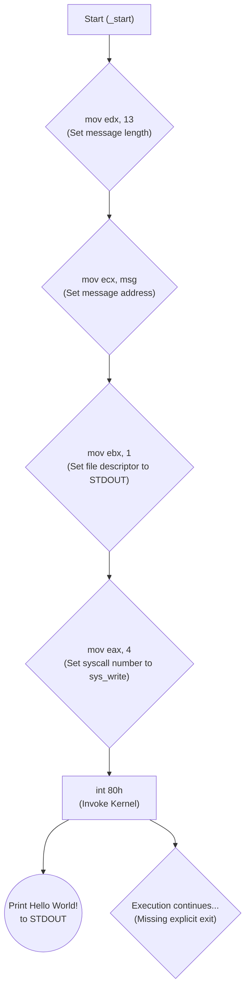

# Understanding `helloworld.asm`

This document explains the `helloworld.asm` program, which prints "Hello World!" to the console on a 32-bit Linux system using NASM assembly syntax.

## Compilation and Linking

The comments at the top of the file provide instructions:

*   **`nasm -f elf helloworld.asm`**: Assembles the code using the Netwide Assembler (NASM).
    *   `-f elf`: Specifies the output format as ELF (Executable and Linkable Format), the standard for Linux executables.
    *   This creates an object file: `helloworld.o`.
*   **`ld -m elf_i386 helloworld.o -o helloworld`**: Links the object file to create an executable.
    *   `ld`: The GNU linker.
    *   `-m elf_i386`: Creates a 32-bit executable. This is important because the system call interface used (`int 80h`) is the 32-bit one. Even on 64-bit Linux, this flag ensures compatibility with the 32-bit syscall mechanism.
    *   `-o helloworld`: Specifies the name of the output executable file.
*   **`./helloworld`**: Executes the compiled program.

## Code Breakdown

### Sections

Assembly programs are often divided into sections:

1.  **`SECTION .data`**: Holds initialized data – variables and constants defined *before* the program runs.
    *   `msg db 'Hello World!', 0Ah`:
        *   `msg`: Defines a label (variable name) for the memory location where the data starts.
        *   `db`: "Define Byte". Reserves memory space for bytes.
        *   `'Hello World!'`: The string literal to be stored.
        *   `0Ah`: The hexadecimal value for the ASCII Line Feed character (`\n`). This ensures the output moves to the next line after printing.

2.  **`SECTION .text`**: Contains the actual program code (instructions).
    *   `global _start`: Makes the `_start` label visible to the linker. `_start` is the default entry point where the operating system begins execution of the program.

### The `_start` Label (Program Entry Point)

Execution begins here:

*   **`mov edx, 13`**:
    *   `mov`: The "move" instruction copies data.
    *   Copies the value `13` into the `edx` register.
    *   `13` is the length (in bytes) of the message: 12 characters for "Hello World!" + 1 byte for the newline character (`0Ah`). The `sys_write` system call requires the length of the data to be written in `edx`.

*   **`mov ecx, msg`**:
    *   Copies the *memory address* of the `msg` variable (where 'H' is stored) into the `ecx` register.
    *   The `sys_write` system call requires the starting memory address of the data buffer in `ecx`.

*   **`mov ebx, 1`**:
    *   Copies the value `1` into the `ebx` register.
    *   `1` is the Linux file descriptor for standard output (STDOUT - usually the terminal screen).
    *   The `sys_write` system call requires the file descriptor to write to in `ebx`. (0 is stdin, 2 is stderr).

*   **`mov eax, 4`**:
    *   Copies the value `4` into the `eax` register.
    *   `4` is the system call number for `sys_write` in the 32-bit Linux kernel Application Binary Interface (ABI). Placing the syscall number in `eax` tells the kernel which operation to perform.

*   **`int 80h`**:
    *   `int`: Generates a software interrupt.
    *   `80h` (hexadecimal 80): This specific interrupt number is the traditional mechanism for invoking 32-bit system calls on Linux.
    *   This instruction transfers control to the kernel. The kernel checks the value in `eax` (which is 4) and executes the corresponding system call (`sys_write`), using the values provided in the `ebx` (file descriptor), `ecx` (buffer address), and `edx` (buffer length) registers.
    *   The result is that "Hello World!" followed by a newline is printed to the terminal.

### Program Exit (Missing)

This program lacks an explicit exit sequence. After the `sys_write` call completes via `int 80h`, the CPU will try to execute the next instruction in memory. Since there isn't one defined, this usually results in the program crashing (often with a "Segmentation fault").

A complete program should explicitly tell the kernel to terminate it using the `sys_exit` system call:

```assembly
; ... (after the first int 80h)
    mov     eax, 1      ; System call number for sys_exit
    mov     ebx, 0      ; Exit code 0 (indicates successful execution)
    int     80h         ; Invoke kernel to exit
```

## Visual Flowchart



### Adding Program Exit

The original `helloworld.asm` lacked an explicit exit call. The corrected version includes the `sys_exit` system call after the `sys_write` call to ensure a clean termination.

Here's the relevant addition from `helloworld2.asm`:

```diff
 ; ... (previous code for sys_write)
     int     80h

+    ; Explicitly exit the program
+    mov     ebx, 0      ; Exit code 0 (success)
+    mov     eax, 1      ; System call number for sys_exit
+    int     80h         ; Invoke kernel
```

This addition calls `sys_exit` (syscall number 1) with an exit code of 0 (passed in `ebx`), ensuring the program terminates gracefully.

## Summary

The program defines a string, sets up registers with the necessary information for the `sys_write` system call (syscall number 4, file descriptor 1 for stdout, message address, message length), and then uses the `int 80h` instruction to ask the Linux kernel to perform the write operation, effectively printing the message to the screen. 